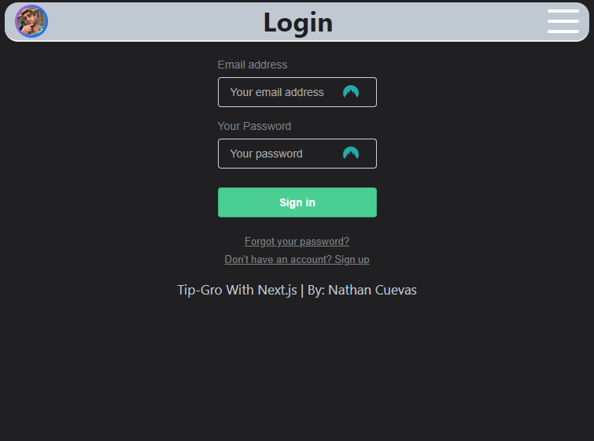
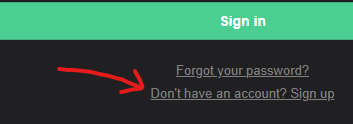
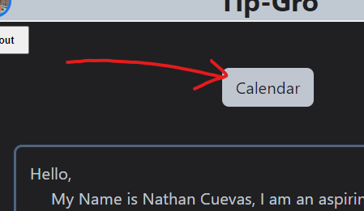
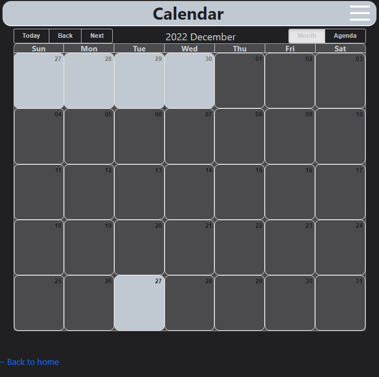
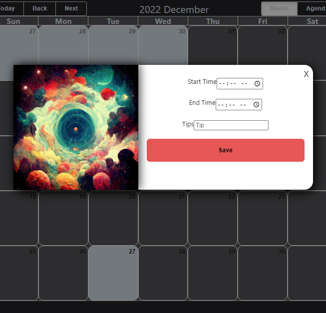
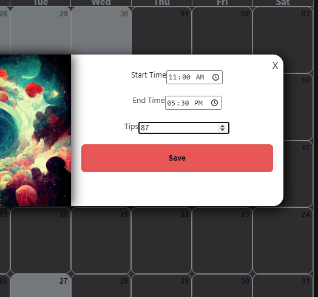
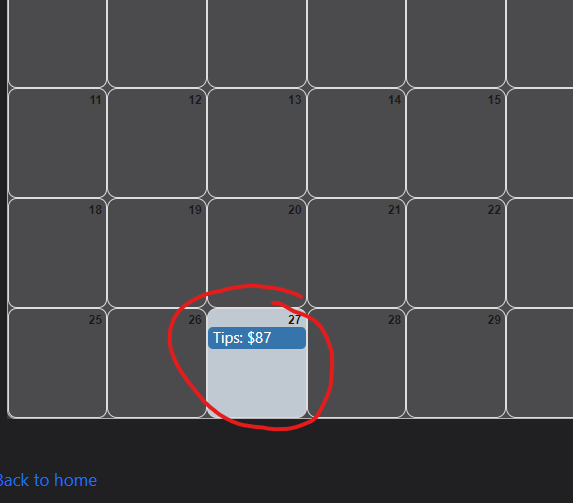

  

# Tip-Gro

## Video Demo:  [Video URL (Youtube)](https://youtu.be/aVHR65VB8Zw)
# Description:
  For this project, I have decided to use the Next.js framework which is built off of the React framework, with a PostgreSQL Backend hosted with supabase and the Prisma ORM to Access it in order to build my web application. Which is a framework for making web applications with javascript. Mainly known for its Component Structure Which allows you to Seperate your apps functionallity and Elements into "Components" allowing for easier read and distributed work. 
  &nbsp; &nbsp;The main reason I chose this framework is because of all the features that it has right out of the box. It comes already with its built in api and its built off of the React framework which allready adds so much. I kept hearing that Next.js was just react supercharged which sounded really nice for me and my use case.
  &nbsp; &nbsp;My web application was something that I had wanted to make and also would have liked to have in my day-to-day life.
  For my web application I made a Tip Tracker for my Part Time job at a reasturant where most of my income is made with tips, So i made something in order to track my tips and how much i am making within a given week/month/etc..  
   
   

 ## Files & Folders

 ### Next.js folder structure
  the pages folder is the main website in that you can have dynamic routing by making folders within that folder and within the folder just created you add an index.js file and now that is the file pointed to when you call https://\<websiteUrl\>/\<foldername\>

  &nbsp; &nbsp; In my project, I have a few folders and files that might need explaining:
  - components - folder - contains all the components(Components: Code Seperated to make code cleaner and easier to read) that i needed in order to build my web application
    - (footer, login, modal, profile) - folder - contains the \<foldername\>.js and the module css file for that component which has allowed me to make my base code look a lot better and now i can import these anywhere accross my whole project.
    - layout.js - file - This is the consistent layout accross my whole app. I have variables that can be passed across the website so i can customize some things, such as the title of the navbar depending on which page i am on.
    - layout.module.css - file - The styling for our layout in order for it to fit on all screens.
  - lib - folder - contains the helper function for a my Prisma ORM( Object-Relational Mapping: Which allows me to make all the nescessary Queries on my database no matter what kind of database it is. )
  - pages - folder - contains all the pages for my web application this is the root directory for my website. the index.js file in here is the root file for my website.
    - api - folder - contains all the api routes for my application so i can call these client side and these files will handle my server code(querying databases, adding data, deleting data).
      - events - folder - contains the api routes for getting the events corresponding to the user and also a handles adding events.
        - addEvent.js - file - The handeler function for adding events into my supabase event database.
        - index.js - file - The handeler function for grabbing all the events in my database that are related to the user that is logged in.
    - _app.js - file - This is Technically the base file for my application so i can add global styling in here to take effect over the whole application.
    - calendar.js - file - This is the file that has the calendar component that I got from an NPM package called react-big-calendar which has enough customizablity for me to do what I'd like with it.
    - index.js - file - The root file for my website which has the login component which checks if their is a session and will log you in if you do but if their is no session then it will prompt you to the login/Register form.
  - prisma - folder - holds the schemas from my supabase database for prisma so that it can access the data properly and also autofill correctly.
  - public - folder - Holds all the public images and icons for my website to look good.
  - styles - folder - contains all the styles made for my application(mainly made for my global CSS styles).
  - utils - folder - contains a file (supabase.js) that has a helper function for conectting to the supabase api if I ever needed it.

## Create Your Own:
  [Create your own Calendar application](#creating-your-own-calendar)

### Example:

## Step 1: Login or Sign Up
  - Visit https://cs-50-final-nu.vercel.app/

  

  - It will automaticlly be in the login screen but if you havent created an account then hit the link at the bottom to sign up.
### Password Requirements:
  - Length must be at least 6 characters

  

  - once you've signed up it will automaticlly log you in and bring you to the home page(index.js) 
  

  - this has a breif description of myself and what i am striving to do, I am using this as a placeholder for now but i do want to add more features later on including: (User Profile/Dashboard, weekly overviews, monthly overviews, deleting events, editing events, adding multiple day logs, using the hamberger icon in top right for user quick access)

## Step 2: Navigate to the Calendar Page

  - but for now you are gonna see right above the description of myself there is going to be a link to the calendar which is the main part of my app.
  
  

## Calendar

  - Once you have entered the calendar you should see this page:

 - Now you have to calendar up you can now add events, only to todays day at the moment, providing support for multiple day events/logs will come later on.
 - if you click on todays day a popup will showup asking you for your shift start time and end time where you have a time input for easy inputing, also right below those you will have your tip amout.
 - You can enter in some values into these inputs and get ready to save the event:
  
  
  

- Once you have everything entered in you can now hit save, Don't  worry it may take some time--if nothing happens after 5 seconds then please click on the save button one more time, then it should work (currently working on a loading Icon for user feedback):

- This is the base of my project You can add events to todays date and it will add the event to the calendar with the title telling yoiu the amount you made that shift
  

# Add-ons In Progress 

  - Ability to add events to past days in the event of someone forgeting to add it the day of the shift
  - Ability to edit the events if data were to get messed up
  - User Profile
  - Hamberger Icon Quick access 
  - Dashboard
  - Weekly report 
  - monthly report

# Creating your own Calendar:

## TBD...

